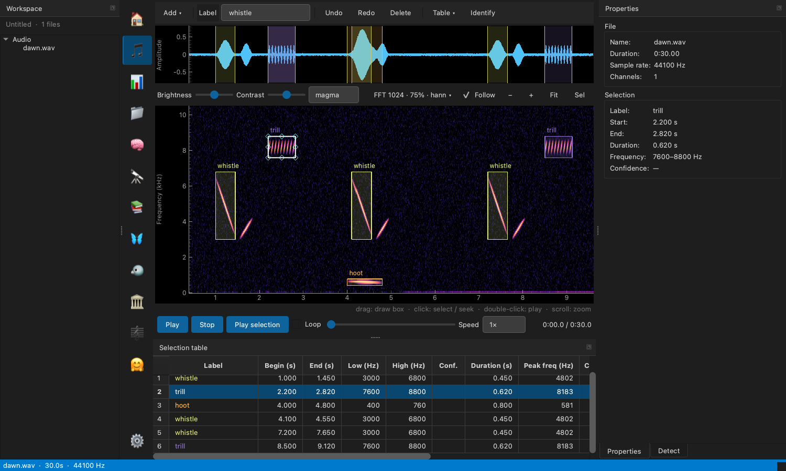

# MagPy

A free, open-source desktop app for looking at, listening to, annotating, and
measuring animal sound recordings. MagPy is the graphical front end to
[bioamla](https://github.com/jmcmeen/bioamla), the bioacoustics and
machine-learning library that does the analysis underneath.



> **Status: alpha.** MagPy is under active development and not yet on PyPI.
> Install it from source (below). Expect rough edges and changes.

## What you can do with it

**Annotate recordings**

- Open any WAV, FLAC, OGG, MP3, or M4A file and see its waveform and spectrogram
  on a shared time axis. Recordings of any length open quickly: the spectrogram
  is rendered for the part you are looking at, and sharpens as you zoom in.
- Drag on the spectrogram to draw a time-frequency box around a sound. Drag on
  the waveform for a time-only selection. Move or resize a box by its handles, or
  type exact bounds into the table.
- Label boxes as you go: set the label for new boxes once, relabel with the
  number keys, or type into the table. Each label gets its own colour.
- Every edit can be undone, and annotations are saved into your workspace
  automatically.
- Tune the picture: brightness, contrast, colormap, FFT size, overlap, and window
  function. Your choices are remembered.

**Listen**

- Play from anywhere, play just the selected box, or loop it.
- Slow playback down to as little as one tenth speed. Pitch drops with speed,
  which brings fast or high-pitched calls into hearing range.

**Measure**

- The selection table shows measurements for every annotation, computed from the
  audio inside its box: duration, peak and center frequency, bandwidths,
  frequency percentiles, RMS and peak level, power, entropy, and peak-frequency
  contour statistics. Choose the columns you want.
- Export the table as CSV with its measurements, or as a Raven-format selection
  table (`.txt`) for use with other tools. Both formats can be imported back.

**Find and identify sounds**

- Run a detector (band-limited energy, pulse-rate, wavelet peaks, or accelerating
  patterns) and review what it finds as dashed candidate boxes on the
  spectrogram. Keep the ones you want as annotations.
- **Identify**: label annotations with an audio classifier. Point MagPy at a
  model on Hugging Face or on disk and it classifies the sound inside each box,
  writing the best guess and its confidence into the table.

**Work with collections**

- Compute acoustic indices (ACI, ADI, AEI, BIO, NDSI, entropy) for a recording.
- Search and download recordings from Xeno-canto, the Macaulay Library,
  iNaturalist, and eBird; pull datasets from Hugging Face.
- Build training datasets from your annotations, train and evaluate classifiers,
  explore embeddings as clusters, and run any single-file operation across a
  whole folder.

## Install

MagPy needs Python 3.10 or newer and [uv](https://docs.astral.sh/uv/).

```sh
git clone https://github.com/jmcmeen/magpy.git
cd magpy
make sync                 # create the environment and install everything
make run                  # launch MagPy
make run FILE=owl.wav     # launch with a recording open
```

For formats other than WAV, FLAC, and OGG, and for the machine-learning features,
bioamla also needs [FFmpeg](https://ffmpeg.org/) installed on your system. See
bioamla's [system dependencies](https://github.com/jmcmeen/bioamla#system-dependencies)
for the supported versions.

## Using the annotation screen

| To do this | Do this |
| --- | --- |
| Draw a box | Drag on the spectrogram |
| Draw a time-only selection | Drag on the waveform |
| Select a box | Click it |
| Move or resize the selected box | Drag it, or drag a handle |
| Move the playhead | Click empty space |
| Play a box | Double-click it |
| Zoom in time | Scroll |
| Zoom in frequency | Ctrl/Cmd + scroll |
| Pan | Right-drag, or scroll sideways |

| Key | Action |
| --- | --- |
| Space | Play / pause |
| Shift+Space | Play the selected box (or the visible span) |
| 1 – 9 | Apply one of the first nine labels to the selected box |
| L | Jump to the label field (Enter applies it to the selected box) |
| Enter | Edit the selected box's label in the table |
| N / P | Next / previous annotation |
| Z | Zoom to the selected box |
| Delete | Delete the selected box |
| Ctrl/Cmd+Z, Shift+Ctrl/Cmd+Z | Undo, redo |
| I | Identify with a model |
| S, B, then Enter | Place a time or box selection from the keyboard, then keep it |

## Workspaces

MagPy always has a workspace open. A workspace is a folder ending in `.magpy`
that remembers which recordings you are working with and holds their
annotations. Recordings are *linked*, not copied, so a workspace stays small and
your original files are never modified. Use **Add ▾ → Import a copy** when you
want a recording stored inside the workspace itself.

## Development

```sh
make check    # lint, format check, and tests
make test     # tests only
make fmt      # auto-format
```

MagPy keeps every bioamla call behind a thin services layer, so the interface
code never depends on bioamla directly. [ARCHITECTURE.md](ARCHITECTURE.md)
explains the layering and the reasoning behind it.

## License

MIT. See [LICENSE](LICENSE).
